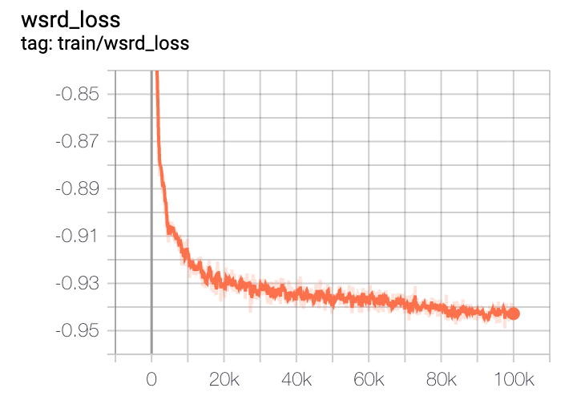
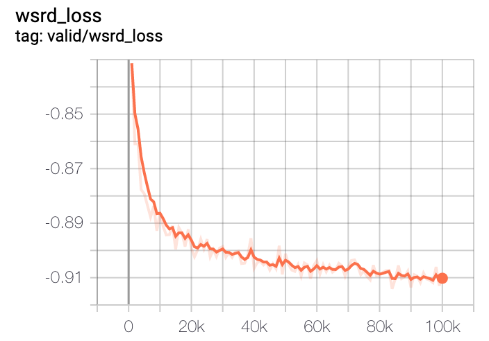

# Source Separation

[](https://www.python.org/downloads/release/python-360/) [](https://hits.seeyoufarm.com)

---


## Introduction

*Source Separation* is a repository to extract speeches from various recorded sounds.
It focuses to adapt more real-like dataset for training models.

### Main components, different things

The latest model in this repository is basically built with spectrogram based models.
In mainly, [Phase-aware Speech Enhancement with Deep Complex U-Net](https://arxiv.org/abs/1903.03107) are implemented with modifications.
- Complex Convolution, Masking, Weighted SDR Loss


And then, To more stable inferences in real cases, below things are adopted.

- Audioset data is used to augment noises.

Dataset source is opened on [audioset_augmentor](https://github.com/AppleHolic/audioset_augmentor).
See this [link](https://research.google.com/audioset/download.html) for finding explanations about audioset.
This repo used *Balanced train label dataset* (Label balanced, non-human classes, 18055 samples)

- Preemphasis is used to remove high-frequency noises on adapting real samples.


### Dataset

[Voice Bank](https://datashare.is.ed.ac.uk/handle/10283/1942) and Audioset (see above section)

You can use pre-defined preprocessing and dataset sources on https://github.com/Appleholic/pytorch_sound


## List to be updated

- [ ] Singing Voice Separation is going on finishing stage (2019.10)


## Environment

- Python > 3.6
- pytorch 1.0
- ubuntu 16.04
- Brain Cloud V2.XLARGE Type (V100 2 GPU, 28 CPU cores, 244 GB memory)


## External Repositories

They are two external repositories on this repository.
*These will be updated to setup with recursive clone or internal codes*

- pytorch_sound package

It is built with using [pytorch_sound](https://github.com/AppleHolic/pytorch_sound).
So that, *pytorch_sound* is a modeling toolkit that allows engineers to train custom models for sound related tasks.
Many of sources in this repository are based on pytorch_sound template.

- audioset_augmentor

Explained it on above section. [link](https://github.com/AppleHolic/audioset_augmentor)


## Pretrained Checkpoint

- Model Name : refine_unet_base (see settings.py)
- Link : [Google Drive](https://drive.google.com/open?id=1JRK-0RVV2o7cyRdvFuwe5iw84ESvfcyR)
- Latest Tag : v0.0.0


## Predicted Samples

- Validation 10 random samples
  - Link : [Google Drive](https://drive.google.com/open?id=1CafFnqWn_QvVPu2feNLn6pnjRYIa_rbP)

- Test Samples : 
  - Link : [Google Drive](https://drive.google.com/open?id=19Sn6pe5-BtWXYa6OiLbYGH7iCU-mzB8j) 


## Installation

- Install above external repos

> You should see first README.md of audioset_augmentor and pytorch_sound, to prepare dataset and to train separation models.

```
$ pip install git+https://github.com/Appleholic/audioset_augmentor
$ pip install git+https://github.com/Appleholic/pytorch_sound@v0.0.1
```

- Install package

```bash
$ pip install -e .
```

## Usage

- Train

```bash
$ python source_separation/train.py [YOUR_META_DIR] [SAVE_DIR] [MODEL NAME, see settings.py] [SAVE_PREFIX] [[OTHER OPTIONS...]]
```

- Synthesize

Single sample

```bash
$ python source_separation/synthesize.py separate [INPUT_PATH] [OUTPUT_PATH] [MODEL NAME] [PRETRAINED_PATH] [[OTHER OPTIONS...]]
```


Whole validation samples

```bash
$ python source_separation/synthesize.py validate [YOUR_META_DIR] [OUTPUT_DIR] [MODEL NAME] [PRETRAINED_PATH] [[OTHER OPTIONS...]]
```


All samples in given directory.

```bash
$ python source_separation/synthesize.py test-dir [INPUT_DIR] [OUTPUT_DIR] [MODEL NAME] [PRETRAINED_PATH] [[OTHER OPTIONS...]]
```


## Loss curves

### Train



### Valid




## License

This repository is developed by [ILJI CHOI](https://github.com/Appleholic).  It is distributed under Apache License 2.0.


## Citation

If you use this repository for research, please cite:

```bibtex
@misc{specunet-audioset,
  author = {Choi, Ilji},
  title = {Spectrogram U-net for Source Separation with Audioset Samples},
  year = {2019},
  publisher = {GitHub},
  journal = {GitHub repository},
  howpublished = {\url{https://github.com/Appleholic/source_separation}}
}
```

