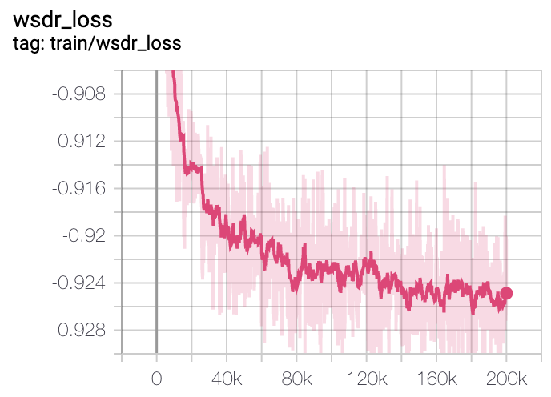
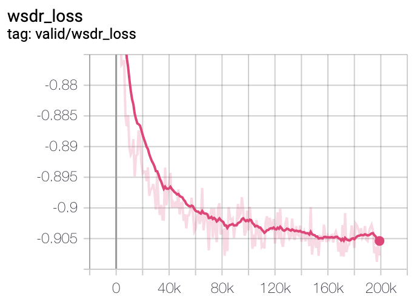

# Source Separation

[](https://www.python.org/downloads/release/python-360/) [](https://hits.seeyoufarm.com)
[](https://colab.research.google.com/github/Appleholic/source_separation/blob/master/assets/Source_Separation_first_notebook.ipynb)
---


## Introduction

*Source Separation* is a repository to extract speeches from various recorded sounds.
It focuses to adapt more real-like dataset for training models.

### Main components, different things

The latest model in this repository is basically built with spectrogram based models.
In mainly, [Phase-aware Speech Enhancement with Deep Complex U-Net](https://arxiv.org/abs/1903.03107) are implemented with modifications.
- Complex Convolution, Masking, Weighted SDR Loss


And then, To more stable inferences in real cases, below things are adopted.

- Audioset data is used to augment noises.

Dataset source is opened on [audioset_augmentor](https://github.com/AppleHolic/audioset_augmentor).
See this [link](https://research.google.com/audioset/download.html) for finding explanations about audioset.
This repo used *Balanced train label dataset* (Label balanced, non-human classes, 18055 samples)

- Preemphasis is used to remove high-frequency noises on adapting real samples.

It's not official implementation by authors of paper.


#### Singing Voice Separation

Singing Voice Separation with [DSD100](https://sigsep.github.io/datasets/dsd100.html) dataset!*
This model is trained with larger model and higher sample rate (44.1k). So it gives more stable and high quality audio.
Let's checkout [Youtube Playlist](https://www.youtube.com/playlist?list=PLQ4ukFz6Ieir5bZYOns08_2gMjt4hYP4I) with samples of my favorites!

#### Recent Updates

- Add Synthesis Colab Notebook Example. You can check out this on the badge or [here](https://colab.research.google.com/github/Appleholic/source_separation/blob/master/assets/Source_Separation_first_notebook.ipynb).


### Dataset

You can use pre-defined preprocessing and dataset sources on https://github.com/Appleholic/pytorch_sound


## Environment

- Python > 3.6
- pytorch 1.0
- ubuntu 16.04
- Brain Cloud (Kakaobrain Cluster) V2.XLARGE (2 V100 GPUs, 28 cores cpu, 244 GB memory)


## External Repositories

There are three external repositories on this repository.
*These will be updated to setup with recursive clone or internal codes*

- pytorch_sound package

It is built with using [pytorch_sound](https://github.com/AppleHolic/pytorch_sound).
So that, *pytorch_sound* is a modeling toolkit that allows engineers to train custom models for sound related tasks.
Many of sources in this repository are based on pytorch_sound template.

- audioset_augmentor

Explained it on above section. [link](https://github.com/AppleHolic/audioset_augmentor)

- pypesq : [git+https://github.com/ludlows/python-pesq](git+https://github.com/ludlows/python-pesq)

For evaluation, PESQ python wrapper repository is added.


## Pretrained Checkpoint

- General Voice Source Separation
  - Model Name : refine_unet_base (see settings.py)
  - Link : [Google Drive](https://drive.google.com/open?id=1JRK-0RVV2o7cyRdvFuwe5iw84ESvfcyR)

- Singing Voice Separation
  - Model Name : refine_unet_larger
  - Link : [Google Drive](https://drive.google.com/open?id=1ywgFZ7ms7CmiCCv2MikrKx9g-2j9kd-I)

- Current Tag : v0.1.1

## Predicted Samples

- *General Voice Source Separation*
  - Validation 10 random samples
    - Link : [Google Drive](https://drive.google.com/open?id=1CafFnqWn_QvVPu2feNLn6pnjRYIa_rbP)

  - Test Samples :
    - Link : [Google Drive](https://drive.google.com/open?id=19Sn6pe5-BtWXYa6OiLbYGH7iCU-mzB8j)

- *Singing Voice Seperation*
  - Check out my youtube playlist !
    - Link : [Youtube Playlist](https://www.youtube.com/playlist?list=PLQ4ukFz6Ieir5bZYOns08_2gMjt4hYP4I)


## Installation

- Install above external repos

> You should see first README.md of audioset_augmentor and pytorch_sound, to prepare dataset and to train separation models.

```
$ pip install git+https://github.com/Appleholic/audioset_augmentor
$ pip install git+https://github.com/Appleholic/pytorch_sound@v0.0.3
$ pip install git+https://github.com/ludlows/python-pesq  # for evaluation code
```

- Install package

```bash
$ pip install -e .
```

## Usage

- Train

```bash
$ python source_separation/train.py [YOUR_META_DIR] [SAVE_DIR] [MODEL NAME, see settings.py] [SAVE_PREFIX] [[OTHER OPTIONS...]]
```

- Joint Train (Voice Bank and DSD100)

```bash
$ python source_separation/train_jointly.py [YOUR_VOICE_BANK_META_DIR] [YOUR_DSD100_META_DIR] [SAVE_DIR] [MODEL NAME, see settings.py] [SAVE_PREFIX] [[OTHER OPTIONS...]]
```


- Synthesize
  - Be careful the differences sample rate between general case and singing voice case!
  - If you run more than one, it can help to get better result.
    - Sapmles (voice bank, dsd) are ran twice.

Single sample

```bash
$ python source_separation/synthesize.py separate [INPUT_PATH] [OUTPUT_PATH] [MODEL NAME] [PRETRAINED_PATH] [[OTHER OPTIONS...]]
```


Whole validation samples (with evaluation)

```bash
$ python source_separation/synthesize.py validate [YOUR_META_DIR] [MODEL NAME] [PRETRAINED_PATH] [[OTHER OPTIONS...]]
```


All samples in given directory.

```bash
$ python source_separation/synthesize.py test-dir [INPUT_DIR] [OUTPUT_DIR] [MODEL NAME] [PRETRAINED_PATH] [[OTHER OPTIONS...]]
```


## Experiments

### Reproduce experiments

- General Voice Separation
  - single train code
  - Pretrained checkpoint is trained on default options
  - Above option will be changed with curriculum learning and the other tries.

- Singing Voice Separation
  - joint train code
  - Pretrained checkpoint is trained on 4 GPUs, double (256) batch size.

### Parameters and settings :

It is tuned to find out good validation WSDR loss
- refine_unet_base : 75M
- refine_unet_larger : 95M


### Evaluation Scores (on validation dataset)

*PESQ score* is evaluated all validation dataset, but wdsr loss is picked with best loss of small subset while training is going on.
> Results may vary slightly depending on the meta file, random state.

> - The validation results tend to be different from the test results.
> - Original sample rate is 22050, but PESQ needs 16k. So audios are resampled for calculating PESQ.

- General (voice bank), 200k steps

|training type|score name| value |
|:------------:|:--------:|:-----:|
|without audioset|PESQ|2.346|
|without audioset|wsdr loss|-0.9389|
|with audioset|PESQ|2.375|
|with audioset|wsdr loss|-0.9078|

- Singing Voice Separation, 200k steps, WSDR Loss
  - Got an error for calculating PESQ on this case.

|training type| value |
|:------------:|:--------:|
|dsd only|-0.9593|
|joint with voice bank|-0.9325|

### Loss curves (Voice Bank)

#### Train



#### Valid




## License

This repository is developed by [ILJI CHOI](https://github.com/Appleholic).  It is distributed under Apache License 2.0.
